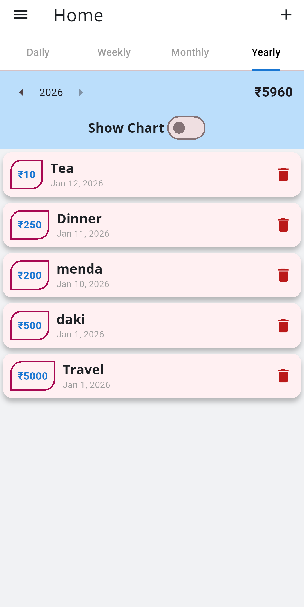
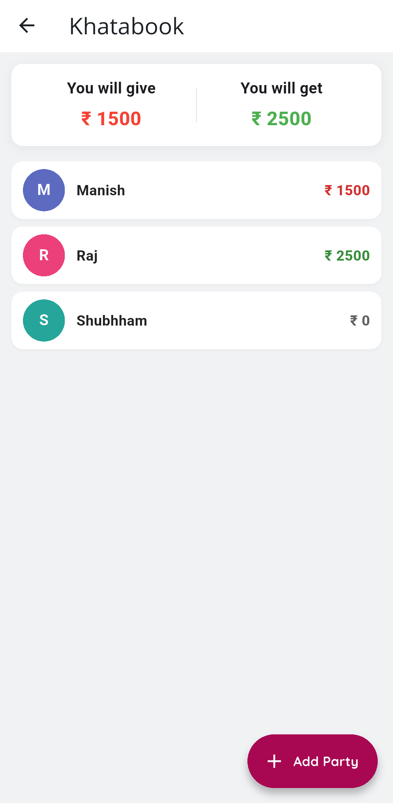

<div align="center">

# BUDGETBUDY

_Detects Spendings, Ensures Quality, Accelerates Money Management_

  

_Built with the tools and technologies:_

    

</div>

---

<!-- App screenshot for quick visual reference -->

<div align="center">


</div>

<hr>

## Table of Contents

- [Overview](#overview)
- [Features](#features)
- [Tech Stack](#tech-stack)
- [Getting Started](#getting-started)
  - [Clone the Repository](#1-clone-the-repository)
  - [Install Requirements](#2-install-requirements)
  - [Run the Application](#3-run-the-application)
- [Model & Data Layer](#model--data-layer)
- [Analytics](#analytics)
- [Export Options](#export-options)
- [License](#license)
- [Author](#author)
- [Screenshots](#screenshots)

## Overview

**BudgetBudy** is a personal finance and ledger management app built with **Flutter**. It combines:

- a **daily spending tracker** for your own expenses, and
- a **Khatabook-style party ledger** for tracking who you will give / who you will get money from.

It's designed to streamline **personal finance management**, reduce manual calculation errors, and provide real-time insights using local SQLite storage — all **offline**, no internet required.

## Features

- 📊 **Daily/Weekly/Monthly/Yearly Views**

  Track your spending across multiple time ranges with tabbed navigation.

- 💰 **Category-Based Transactions**

  Add expenses with title, amount, date, and category for better organization.

- 👥 **Khatabook-Style Party Ledger**

  Create parties (contacts) and track "gave" or "got" transactions per party.

- 📈 **Automatic Balance Calculation**

  See **You will give** and **You will get** totals automatically calculated.

- 🎨 **Modern UI Design**

  Clean Material Design with custom fonts (`OpenSans`, `Quicksand`) and color-coded balances.

- 📊 **Visual Analytics**

  Charts and graphs using `fl_chart` for spending patterns and trends.

- 💾 **Offline Storage**

  All data stored locally using SQLite — no backend or internet connection needed.

- 🔄 **Real-Time Updates**

  Provider state management ensures UI updates instantly when data changes.

## Tech Stack

- **Framework/UI**: Flutter, Material Design
- **Language**: Dart
- **State Management**: Provider
- **Local Database**: SQLite (sqflite)
  - Separate databases for spendings (`spendings.db`) and party ledger (`khatabook.db`)
- **Utilities & Libraries**:
  - `intl` – Date formatting and localization
  - `fl_chart` – Beautiful charts and graphs
  - `random_color` – Color utilities for UI
  - `url_launcher` – Open external links

## Getting Started

### 1. Clone the Repository

```bash
git clone https://github.com/devaldaki3/BudgetBudy.git
cd BudgetBudy
```

### 2. Install Requirements

Make sure Flutter is installed and configured:

```bash
flutter doctor
```

Then install project dependencies:

```bash
flutter pub get
```

### 3. Run the Application

```bash
flutter run
```

Select your device/emulator when prompted.  
The app will start with the **Home** screen (spending tabs). You can navigate to the Khatabook ledger from the drawer or dedicated navigation option.

## Model & Data Layer

### Personal Spending (`Transaction` / `Transactions`)

- **Transaction Model**:
  - `id`, `title`, `amount`, `date`, `category`
- **Transactions Provider**:
  - Stores list of transactions in memory
  - Persists data via `DBhelp/dbhelper.dart` into `spendings.db`
  - Provides CRUD operations: `addTransactions`, `deleteTransaction`, `fetchTransactions`
  - Filters: daily, weekly, monthly, yearly, recent (last 7 days)
  - Aggregations for charts and totals

### Party Ledger (`Party`, `TransactionModel`)

- **Party Model**:
  - `id`, `name`, `phone`
- **TransactionModel**:
  - `id?`, `partyId`, `amount`, `type (gave/got)`, `date`, `note`
- **Database Helper** (`database/db_helper.dart`):
  - Creates and manages `khatabook.db`
  - Tables:
    - `parties` (id, name, phone)
    - `transactions` (linked to parties via foreign key)
  - Provides functions to:
    - Insert/update/delete parties and transactions
    - Compute per-party balance and totals
    - Get transactions by party ID

## Analytics

- **Time-Based Analytics**: Daily, weekly, monthly, yearly spending breakdowns
- **Chart Visualizations**: Using `fl_chart` for pie charts and bar graphs
- **Balance Summary**:
  - Total spending across all transactions
  - "You will give" vs "You will get" totals for party ledger
- **Recent Activity**: Last 7 days transaction view

## Export Options

- ✅ **Future Enhancement**: Export personal transactions or party ledger data as CSV
- ✅ **Future Enhancement**: Generate PDF summary reports for a month or a party
- ✅ **Future Enhancement**: Backup/restore database functionality

## License

This project is licensed under the MIT License.

You can use, modify, and distribute it freely with proper attribution.

## Author

Developed with ❤️ by [@devaldaki3](https://github.com/devaldaki3)

Feel free to contribute, raise issues, or suggest improvements.

## Screenshots

<div align="center">

**Home Screen - Daily Spending**



**Party List - Khatabook Ledger**



</div>

[⬆️ Back to Top](#table-of-contents)
